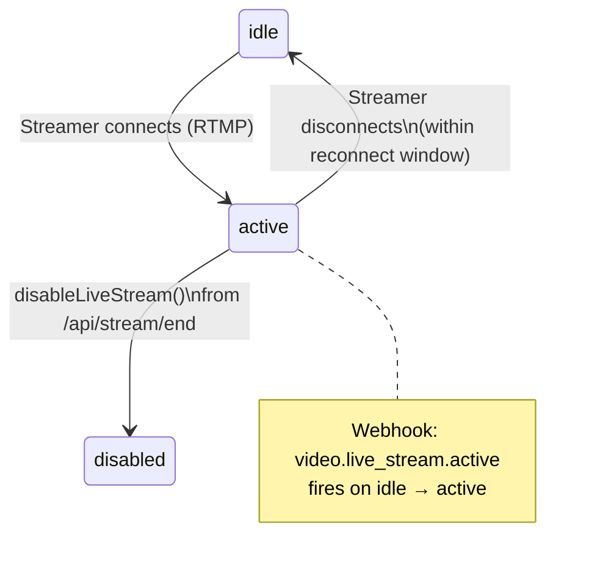
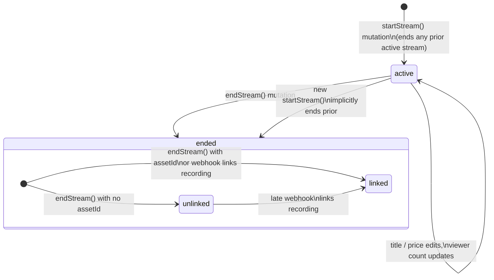
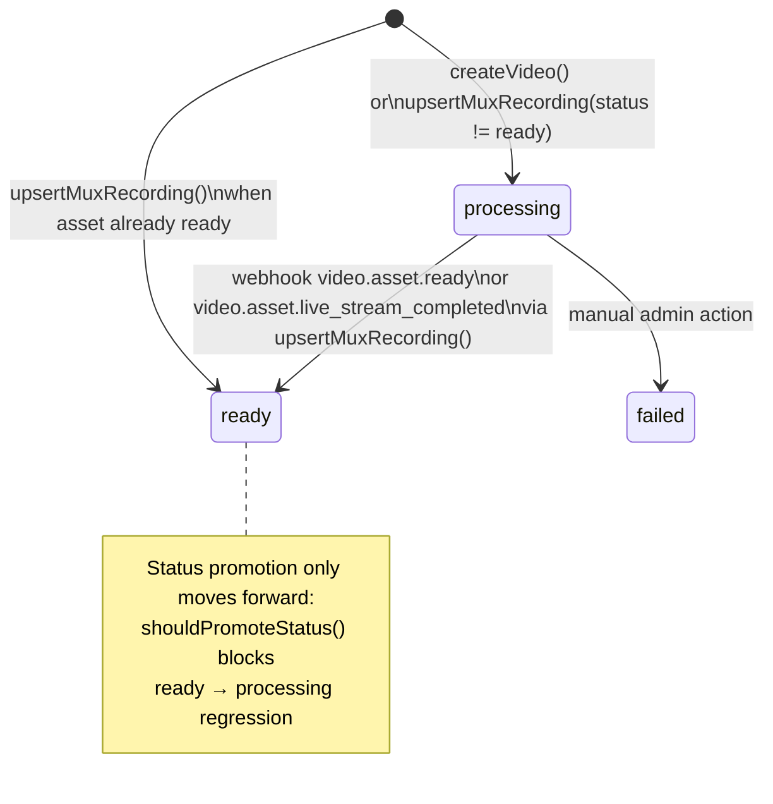
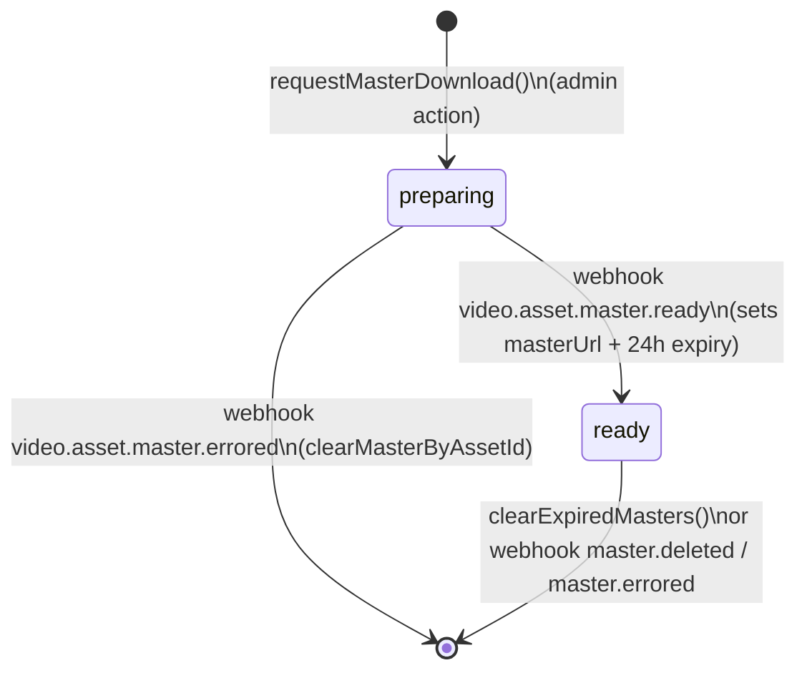
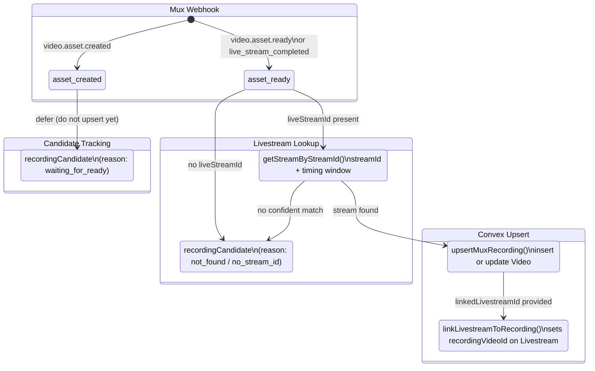

# Mux / Convex State Diagrams

Reference state machines for the three core objects in the streaming pipeline plus the cross-object recording ingest flow.

## 1. Mux Live Stream States

The Mux-side lifecycle observed through webhooks.

**Key files:** `lib/mux.ts` (`disableLiveStream`), `app/api/stream/end/route.ts`, `app/api/webhooks/mux/route.ts` (`video.live_stream.active` handler)

---

## 2. Convex Livestream States (`livestreams` table)

**Fields set on link:** `recordingVideoId`, `recordingAssetId`, `recordingSource` (`"webhook"` | `"end_stream"`), `recordingLinkedAt`

**Key files:** `convex/livestream.ts` (`startStream`, `endStream`, `updateStreamStartedAt`), `convex/recordingIngest.ts` (`linkLivestreamToRecording`)

---

## 3. Convex Video States (`videos` table)

Two parallel state tracks managed independently.

### 3a. Primary Status

**Status priority:** `uploading (0)` < `processing (1)` < `ready (2)` — see `STATUS_PRIORITY` in `convex/recordingIngest.ts`

**Normalization:** Mux statuses `"preparing"`, `"created"` are mapped to `"processing"` by `normalizeMuxStatus()`

### 3b. Master Download Status (`masterStatus`)

**Fields:** `masterStatus` (`"preparing"` | `"ready"` | `undefined`), `masterUrl`, `masterExpiresAt` (24h TTL)

**Key files:** `convex/videos.ts` (`requestMasterDownload`, `updateMasterStatusByAssetId`, `clearMasterByAssetId`, `clearExpiredMasters`), `app/api/webhooks/mux/route.ts` (master event handlers)

---

## 4. Recording Ingest Flow (cross-object)

How a Mux asset event flows through the system and links to Convex objects.

### Parallel Ingest Paths

Both paths use `upsertMuxRecording()` which is idempotent by `assetId`:

| Path | Trigger | Source field |
|------|---------|-------------|
| **Webhook** | `video.asset.ready` or `live_stream_completed` | `source: "webhook"` |
| **End-stream API** | `/api/stream/end` polls Mux, passes asset to `endStream()` | `source: "end_stream"` |

Whichever arrives first creates the video row; the second updates it without duplicating.

**Key files:** `convex/recordingIngest.ts` (`upsertMuxRecording`, `linkLivestreamToRecording`), `app/api/webhooks/mux/route.ts` (`upsertMuxAsset`), `app/api/stream/end/route.ts` (`fetchRecordingAsset`), `convex/livestream.ts` (`endStream`)
